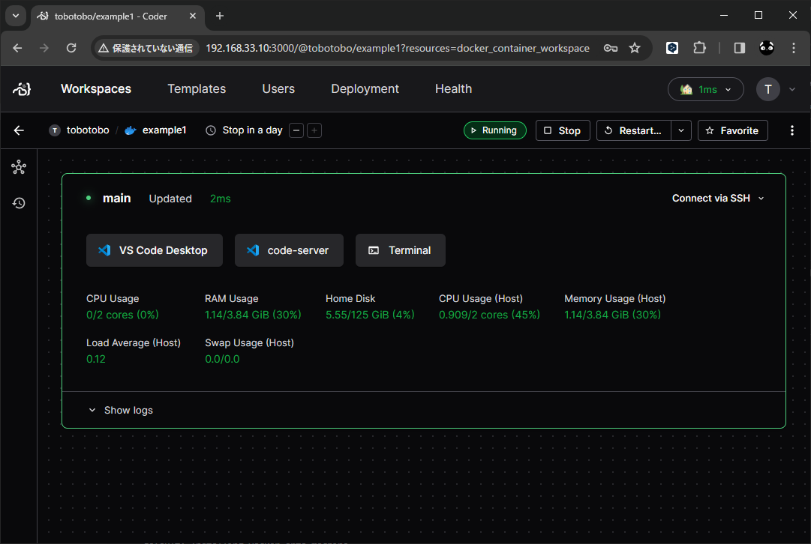

# vagrant_coder

## 概要
Vagrant を使ってとりあえず Coder を使ってみる。 

Coder  
https://github.com/coder/coder

※DeepL

Coderは、企業がパブリックまたはプライベートクラウドインフラストラクチャに開発環境を構築することを可能にします。  
クラウド開発環境はTerraformで定義され、セキュアな高速Wireguard®トンネルで接続され、使用しないときは自動的にシャットダウンされ、コストを削減します。  
Coderは、エンジニアリングチームが最も有益なワークロードのためにクラウドを使用する柔軟性を提供します。

* Terraformでクラウド開発環境を定義する
* EC2 VM、Kubernetes Pods、Docker Containersなど。
* アイドル状態のリソースを自動的にシャットダウンしてコストを削減
* 数日ではなく数秒で開発者をオンボード

## 【注意】 CODER_ACCESS_URL を設定しないと外部から接続可能なトンネルが自動的に設定される

Coder を起動する時、CODER_ACCESS_URL が設定されていない場合、Coder は外部から `https://XXXXXXXXXXXXX.pit-1.try.coder.app` の URL でアクセス可能なトンネルを自動的に設定します。  
※ XXXXXXXXXXXXX はランダムな英数字

セキュリティの担保はしていると思うが、外部からアクセスできる状態そのものが好ましくない場合は、CODER_ACCESS_URL を必ず設定すること。

Coder - Configuration - Tunnel  
https://coder.com/docs/v2/latest/admin/configure#tunnel
> If an access URL is not specified, Coder will create a publicly accessible URL to reverse proxy your deployment for simple setup.  
> (※DeepL) アクセス URL が指定されていない場合、Coder は一般にアクセス可能な URL を作成し、簡単なセットアップのためにデプロイメントをリバースプロキシします。

```
$ coder server
Coder v2.9.0+3215464 - Your Self-Hosted Remote Development Platform
Started HTTP listener at http://127.0.0.1:3000
Using built-in PostgreSQL (/home/vagrant/.config/coderv2/postgres)
Opening tunnel so workspaces can connect to your deployment. For production scenarios, specify an external access URL

View the Web UI: https://XXXXXXXXXXXXX.pit-1.try.coder.app
2024-03-16 23:31:58.022 [info]  pubsub: pubsub dialing postgres  network=tcp  address=localhost:34389  timeout_ms=0
2024-03-16 23:31:58.022 [info]  pubsub: pubsub postgres TCP connection established  network=tcp  address=localhost:34389  timeout_ms=0  elapsed_ms=0
2024-03-16 23:31:58.026 [info]  pubsub: pubsub connected to postgres
2024-03-16 23:31:58.027 [info]  pubsub: pubsub has started
...
```

## 詳細

インストール
```
curl -L https://coder.com/install.sh | sh
```

起動
```
export CODER_HTTP_ADDRESS=0.0.0.0:3000
export CODER_ACCESS_URL=http://192.168.33.10:3000
coder server
```

## Code-Server で Microsoft の拡張機能マーケットプレイスを使用するには？

【注意】  
Microsoft は、Microsoft 以外の VS Code のマーケットプレイスへのアクセスを禁止しています。  
よって、以下の設定は利用規約に違反します。  
設定する場合は自己の責任で実施してください。

/home/ユーザー名/.bashrc
```
export EXTENSIONS_GALLERY='{\
    "serviceUrl": "https://marketplace.visualstudio.com/_apis/public/gallery",\
    "cacheUrl": "https://vscode.blob.core.windows.net/gallery/index",\
    "itemUrl": "https://marketplace.visualstudio.com/items"}'
```

## スクリーンショット




* 右上の Stop や Restart でインスタンスの操作が可能
* 中央の VS Code Desktop 、code-server、Terminal をクリックすると、下図のように対応するウィンドウが開く  
  ※下図は操作した後のものなので、初期表示は英語だったりと実際は少し異なる。

VS Code Desktop  


code-server  


Terminal  
  
